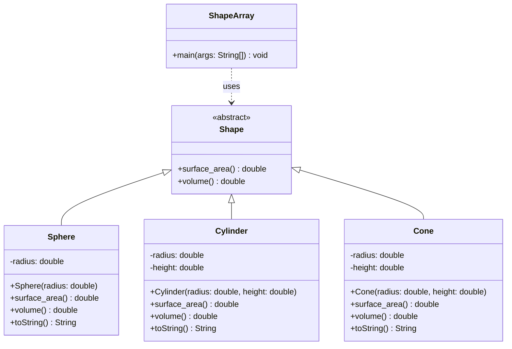

# UML Diagram for Shape Hierarchy

```mermaid
classDiagram
    class Shape {
        <<abstract>>
        +surface_area() double
        +volume() double
    }

    class Sphere {
        -radius: double
        +Sphere(radius: double)
        +surface_area() double
        +volume() double
        +toString() String
    }

    class Cylinder {
        -radius: double
        -height: double
        +Cylinder(radius: double, height: double)
        +surface_area() double
        +volume() double
        +toString() String
    }

    class Cone {
        -radius: double
        -height: double
        +Cone(radius: double, height: double)
        +surface_area() double
        +volume() double
        +toString() String
    }

    class ShapeArray {
        +main(args: String[]) void
    }

    Shape <|-- Sphere
    Shape <|-- Cylinder
    Shape <|-- Cone
    ShapeArray ..> Shape : uses
```

This diagram shows the abstract Shape superclass and the concrete Sphere, Cylinder, and Cone subclasses used by the driver class.
